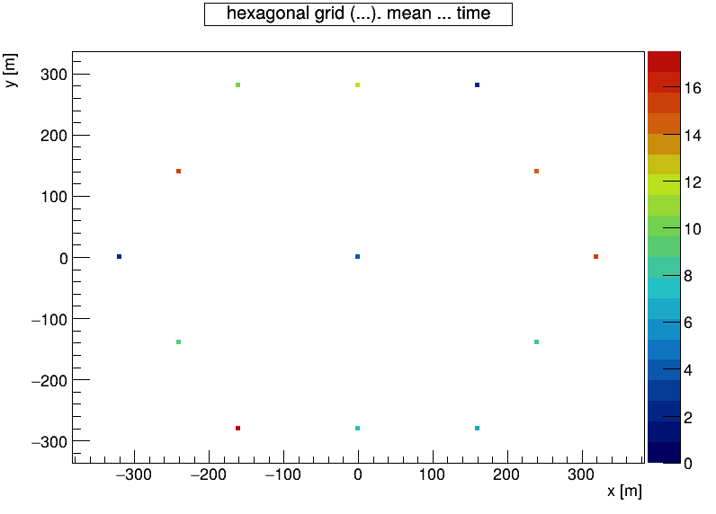

# Puzzle Picture — [ROOT framework (CERN)](https://root.cern/)

[](https://www.auger.org/)

```C++
#include <vector>
#include <ranges>
#include <TStyle.h>
#include <TArrayI.h>
#include <TColor.h>
#include <TH2F.h>
#include <TCanvas.h>
#include <TScatter.h>

int main()
{
    const auto nBins = 20;  // Limit number of color-bins, independent of major-ticks in colorbar.

    gStyle->SetPalette(kRainBow);
    const TArrayI& palette = TColor::GetPalette();
    auto bin_palette_view = std::views::iota(0, nBins)
                            | std::views::transform([&](int idx) {
                                  return palette[idx * (palette.GetSize() / nBins)];
                              });

    std::vector<int> bin_palette(bin_palette_view.begin(), bin_palette_view.end());
    gStyle->SetPalette(nBins, bin_palette.data(), 1);

    std::vector<double> x = {0, 0, -160, 160, -160,  160,   0,    0, 320, -320, 240,  240, -240, -240};
    std::vector<double> y = {0, 0,  280, 280, -280, -280, 280, -280,   0,    0, 140, -140,  140, -140};
    std::vector<double> c = {0, 4,   10,   2, 17.5,    6,  12,    7,  16,    2,  15,    8,   16,    9};
    auto [cMin, cMax] = std::ranges::minmax(c);

    auto canvas = std::unique_ptr<TCanvas>(new TCanvas("c1", "scatter plot", 800, 600));
    auto scatter = std::unique_ptr<TScatter>(new TScatter(x.size(), x.data(), y.data(), c.data(), nullptr));

    scatter->SetMarkerStyle(21);
    scatter->SetMarkerSize(0.7);
    scatter->GetHistogram()->SetMinimum(cMin);
    scatter->GetHistogram()->SetMaximum(cMax);

    scatter->GetHistogram()->SetTitle("hexagonal grid (...). mean ... time; x [m]; y [m]");
    gStyle->SetTitleBorderSize(1);  // Add a personal touch, with border around title.
    gStyle->SetTitleFontSize(0.035);

    scatter->Draw("AP");
    canvas->SaveAs("puzzle-picture-ROOT.png");

    return 0;
}
```

> Kant's Axe? (No background in grammar?): "_[Alleen **zij** die groots **durven** te falen, **kunnen** ooit groots bereiken.](https://citaten.net/quotes/robert_f_kennedy/40114/citaat-alleen-wie-het-aandurft-om-groots-te-falen-krijgt-de-kans-om.html)_" — Robert F. Kennedy

[References](REFERENCES.md)

[](LICENSE.md)
[-blue?style=for-the-badge)](https://root.cern/about/license/)
